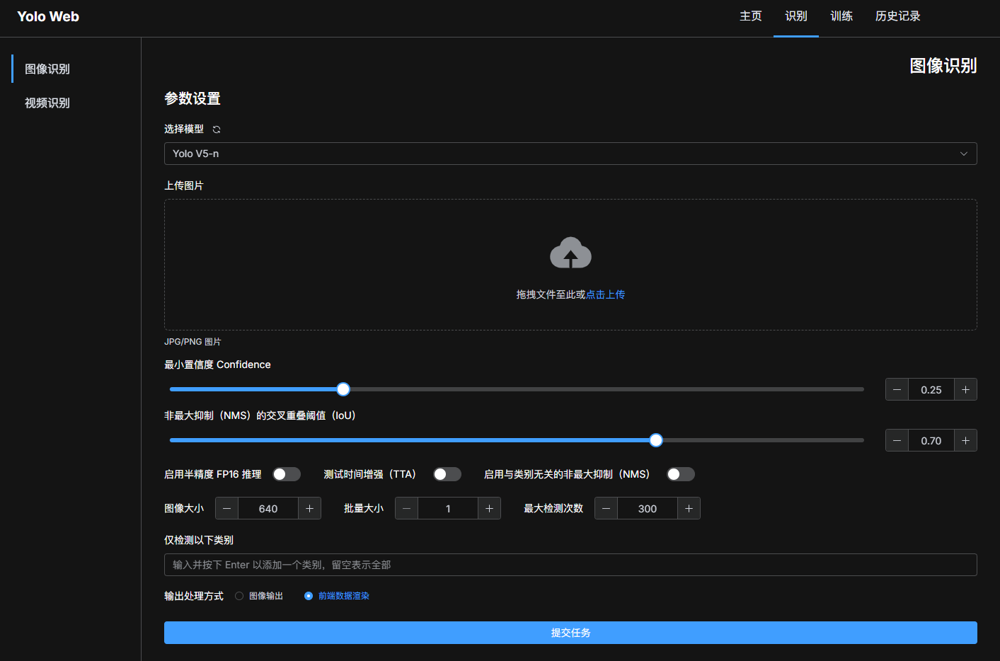
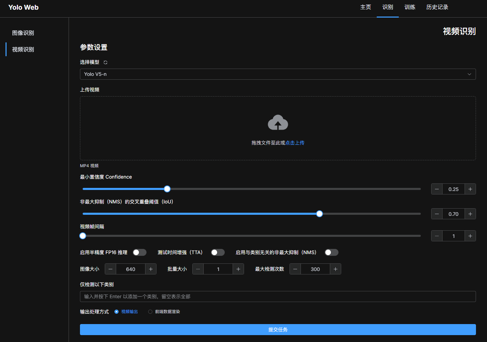
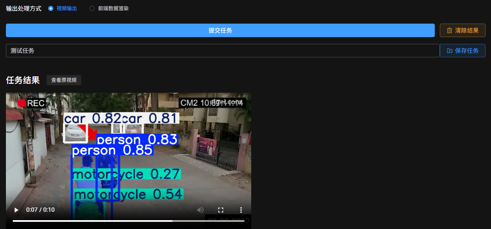
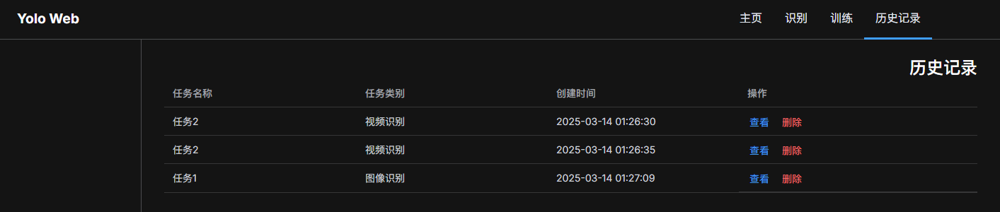

# Yolo Web Pannel

这是一个基于 API 的 Yolo 训练、识别、检测本地一体化的 Web 管理面板。

## 技术栈

### 前端

> 位于 [src/](./src) 目录下。

采用 SSG 技术，基准生成框架使用 [Astro](https://astro.build/)，并集成 [Vue](https://vuejs.org/).

图标库、组件库部分采用了 [Element Plus](https://element-plus.org/).

### 后端

> 位于 [server/](./server) 目录下。

后端使用 [Bun](https://bun.sh/) 运行时运行，使用 TypeScript 编写。

开发时后端采用文件式存储，数据库采用 SQLite.

后端用于存储并处理历史记录，以及相关的模型参数、文件等。

## 主要界面预览

### 识别界面

识别界面支持对多种数据流进行处理，包括图片、视频。

用户选择模型，上传对应文件，填写输入参数，点击 `提交任务`，服务端会调用相关 API 完成任务，并返回输出内容。



对于视频而言，增加了 `视频帧间隔` 选项，以用于分隔进行识别的帧图像。对于部分静态移动的场景，调大该值可以减小识别的总计算量。



输出格式上，主要采用前端数据渲染和二进制输出两种方式：

|输出格式|说明|优缺点|
|---|---|---|
|前端数据渲染|后端将返回详细的模型输出数据，例如每一个识别对象的 box 大小、位置等信息，对于视频而言，还包括其对应的时间、帧数等信息，前端处理这些数据进行渲染。|节省带宽，依赖于前端性能，最终渲染效果相对受限。|
|二进制输出|后端将返回处理完毕的二进制图像、视频等格式，前端直接展示。|带宽消耗较大，后端生成内容的处理时间长，依赖于服务端性能，但是前端渲染效果更好。|

任务提交并完成后，用户可以输入任务名进行保存，保存后的任务可以在历史记录中查看。



界面提供了 `查看原图` `查看原视频` 的功能，以用于对比输入和输出。

### 历史记录

支持查看、删除操作。



## 配置、构建和部署

### 配置文件

前端配置文件位于项目根目录下的 [config.toml](./config.toml) 文件中，其中 `api_base` 表示后端 API 的路径。

服务端配置文件位于 [server/config.toml](./server/config.toml) 文件中，相关字段的说明如下：

- `server`：服务端相关的配置。
- `database`：数据库相关的配置。
- `models`：是一个列表，每一个列表项表示一个模型的配置，包括模型的识别 ID、显示名称、和 API 参数。有关 API 参数，参考后文中的 **API 开放性** 节。

### 构建

前端构建要求机器具备 Node.js 环境，只需要在项目的更目录下执行以下命令：

1. 安装依赖：

   ```bash
   pnpm install
   ```

2. 构建：

   ```bash
   pnpm build
   ```

前端构建后的文件位于 `dist/` 目录下。

运行后端，需要安装 [Bun](https://bun.sh/) 运行时。只需要在 [server/](./server/) 目录下执行以下命令：

```bash
bun start
```

### 部署

项目采用的是前后端分离模式，需要在进行部署时进行路由配置。例如 Nginx 的部署配置可能如下：

```conf
upstream backend {
    server 127.0.0.1:3000;
}

# map $http_upgrade $connection_upgrade {
#     default keep-alive;
#     'websocket' upgrade;
#     '' close;
# }

server {
    listen 80 default;

    location / {
        root /var/www/html/;
        try_files $uri $uri/ =404;
    }

    location /api {
        proxy_pass http://backend;
        proxy_set_header Host $host;
        proxy_http_version 1.1;
        proxy_set_header Upgrade $http_upgrade;
        proxy_set_header Connection "Upgrade";
        proxy_set_header Range $http_range;
        proxy_set_header If-Range $http_if_range;
        proxy_set_header X-Real-IP $remote_addr;
        proxy_set_header X-Forwarded-For $proxy_add_x_forwarded_for;
        proxy_set_header X-Forwarded-Host $server_name;
        proxy_set_header X-Forwarded-Proto $scheme;
        proxy_redirect off;
    }
}
```

一些部署的配置片段位于项目的 [deploy/](./deploy) 目录下。

## API 开放性

在服务端的配置文件中，`models` 字段表示了模型的配置，其中包含了 `api_base` 和 `api_key` 等字段。

该项目的开放性依赖于相同的 API 接口实现。API 接口终结点相关标准如下：

- **POST** `/model/:id`

  模型调用，其中 `id` 为模型识别 ID.

  - **请求体**：

    请求体需包含 `Accept` 头，类型为 `application/json` 或其它二进制 mimetype，用于指定返回数据的格式。

    类型：`application/json`

    |参数名|类型|说明|
    |---|---|---|
    |`file`|`blob`|文件数据|
    |`source`|`string`|输入文件类型，`image` 或 `video`|
    |...|...|模型详细参数|

  - **响应体 `application/json`**：

    |参数名|类型|说明|
    |---|---|---|
    |...|...|模型输出数据|

  - **响应体 `二进制 mimetype`**：

    返回文件数据。
